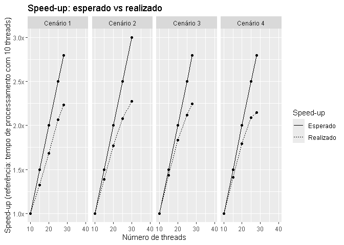

# Geocode benchmark

Teste feito para analisar o efeito do número de threads sobre o tempo de
processamento da geolocalização usando o `{geocodepro}`. Foram
geolocalizados 100.000 endereços aleatórios retirados do CNES. Cinco
testes foram feitos com cada opção de número de threads (i.e. cinco com
10 threads, cinco com 15, etc), e o tempo reportado nas figuras a seguir
é a média dessas cinco observações. Quatro cenários foram analisados:

- Cenário 1: Hardware Dell 940 comprado em 2017. Repositório estava
  salvo na rede. Havia a opção de rodar com até 60 cores, mas causava
  hyperthreading. Número de threads limitado em 28.
- Cenário 2: Hardware Dell 940 comprado em 2017. Repositório salvo em
  pasta local. Configuração do servidor foi mudada, havia a opção de
  rodar com até 40 cores. Número de threads limitado em 30.
- Cenário 3: Hardware Dell 940 comprado em 2017. Repositório estava
  salvo na rede. Configuração do servidor foi novamente mudada, havia a
  opção de rodar com até 30 cores. Número de threads limitado em 28.
- Cenário 4: Hardware HCI Lenovo VX630V3, modelo 2023. Repositório salvo
  em pasta local. Número de threads limitado em 28.

No gráfico abaixo, o speed-up esperado foi calculado como a razão entre
o número de threads dividido por 10 (que é o menor número de threads que
foi analisado no teste). O speed-up realizado foi calculado como o tempo
de processamento usando 10 threads dividido pelo tempo de processamento
usando os demais números de threads analisados.

