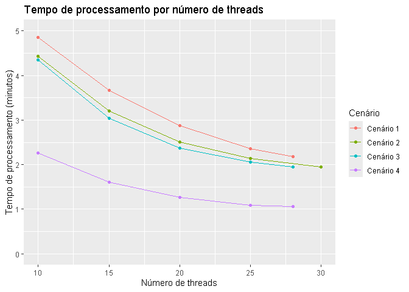

# Geocode benchmark

Analisando o efeito do número de threads e observações no tempo de
processamento.

``` r
library(ggplot2)
library(targets)

timings <- tar_read(timings)
timings <- data.table::rbindlist(timings)

ggplot(timings) +
  geom_point(aes(x = n_threads, y = time, color = n_rows))
```


